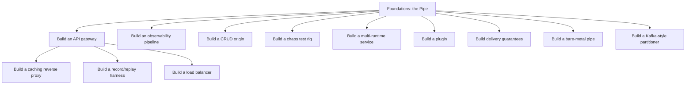

# proxima tutorials

Teaching material for **humans** building things from proxima's pipe primitives. (Agents that just need the combinator vocabulary should read `ai_docs/examples-index.jsonl` and the runnable `examples/` — this tree is the narrative that teaches a person *why*.)

## The discipline: no forward references

Every tutorial obeys one rule: **no concept, combinator, codec, or type appears before it has been taught.** A section may only use primitives from [Foundations](./00-foundations.md) plus the ones it introduces itself, in order. The dependency graph below is the contract — if a section needs a concept it hasn't earned, that is a bug in the curriculum, not a shortcut to take.

Sections are **self-contained**: each states its prerequisites up front and can be read on its own. When a section reuses a primitive first taught elsewhere (e.g. `proxy`, introduced by the Gateway), it gives a one-paragraph recap and links back rather than assuming you read that section.

## Start here

- **[Foundations: the Pipe](./00-foundations.md)** — the base. `Pipe` · the four roles · errors · `and_then`/`AndThen` · the four tiers (`Pipe`/`SendPipe`/`UnpinPipe`/`UnpinSendPipe`) · `#[proxima::piped]` (stateless free-fn form + stateful `impl` form — you almost never hand-write `impl Pipe` anymore) · the pipe algebra (filter, fan-out, fan-in, gate, signal) · the served `Pipe` · `into_handle` · serve. Everything else stands on this.
- **[Foundations, part 2: the pipe ergonomic surface](./01-ergonomics.md)** — the sugar layer on top: `PipeExt` (`.and_then`/`.filter`/`.fanout`/`.fanin`, one blanket trait) · the leaf macros (`pipe!`/`filter!`/`fanout!`/`fanin!`) · `#[proxima::piped]`'s impl-all tier closure, precisely · `App::mount`'s four accepted shapes (`IntoMountTarget<Via>`) · why time is a composed `Clock` capability, never a special method on `Pipe`. Adds no new capability over Foundations — read it once Foundations feels solid, to stop hand-rolling what these already give you for free.
- **[Foundations, part 3: the Listener builder, mirrored from the Client](./02-listener-builder.md)** — `Listener::builder()`/`Listener::http(bind)`, the serve-side mirror of `Client::builder()`/`Client::http(url)`, built from the same `SpecBuilder`/`ProtocolSugar`/`TransportSugar` seam · `resolve_listen_protocol` (`.tcp()`/`.h3()`/`.grpc()`/`.h2()`/`.pgwire(query)` resolved to one concrete `ListenProtocol`) · `TlsListenProtocol`, TLS as a composed decorator instead of a spec field · `ListenerSpec::protocol`, the escape hatch for an out-of-crate wire · the two places a listener's builder honestly cannot mirror the client's. Read after Foundations part 2 if you are about to hand-roll `App::new()` + manual `RunConfig` wiring more than once.
- **[The native runtime: serving real HTTP with zero tokio](./03-native-runtime.md)** — the `Runtime` trait · `http1` vs. `http1-native` (tokio-coupled vs. tokio-free h1) · `#[proxima::main]`'s ambient-runtime seam and the collapse it causes if you don't opt out with `.with_runtime`/`.with_acceptor_factory` · `ShutdownBarrier` · a runtime shared on purpose (`deferred_runtime`) vs. adopted by accident. Walks `proxy` → `gateway` → `load-balance` → `integration` → `distributed_trace`, all served tokio-free, then contrasts `multi_runtime`/`runtime_select` where tokio is deliberately opted into.

## Build a ... (each project is complete in itself)

### Wave 1 — the core services

| Tutorial | You build | New primitives (in order) |
|---|---|---|
| [Build an API gateway](./build-an-api-gateway.md) | HTTP in → forward to upstream, route by path, rate-limit per upstream, require auth | `Client` forward · `RoutingPipe` · `RateLimit` (token bucket) · `Auth` (short-circuit filter) |
| [Build a caching reverse proxy](./build-a-caching-reverse-proxy.md) | front a slow origin with a cache (origin hit once, then cache hits) | `KvCache`/`KvUpstream` · `Fallthrough` selection · `WriteBack` |
| [Build a record/replay harness](./build-a-record-replay-harness.md) | record live traffic, replay it byte-identical for tests | `RecordUpstream` + sink chain · `TerminalSignal` · `ReplayUpstream` (typed miss) |
| [Build an observability pipeline](./build-an-observability-pipeline.md) | filter by level, fan one event to console+file sinks, make the backpressure choice explicit | level `filter` · `fan_exporters` (fan-out) · `HeapBoundedQueue`/`FailMode` backpressure |

### Wave 2 — composition and runtimes

| Tutorial | You build | New primitives (in order) |
|---|---|---|
| [Build a load balancer](./build-a-load-balancer.md) | distribute requests across a pool of healthy backends, skip the unhealthy | backend pool (`Client` + health) · round-robin `select` over healthy · forward |
| [Build a chaos test rig](./build-a-chaos-test-rig.md) | seeded, reproducible fault injection; absorb it with retry + fallback | `Chaos<Inner>` (seeded error/drop/delay) · `RetryController` · `Fallback` |
| [Build a CRUD origin service](./build-a-crud-origin-service.md) | proxima AS the origin — a small REST service over a shared store | shared store (Arc-cloned) · handler-per-verb (transform) · `mount_with_methods`/`MethodFilter` · `{id}` path params |
| [Build a multi-runtime service](./build-a-multi-runtime-service.md) | serve the same sans-IO pipe on prime AND tokio concurrently, sharing state | the `Runtime` trait (prime/tokio impls) · two runtimes, one process · shared state |

### Wave 3 — extension and the frontier

| Tutorial | You build | New primitives (in order) |
|---|---|---|
| [Build a plugin](./build-a-plugin.md) | package a Pipe as a crate others compose in one line | a wrapping `Pipe` · `PipeFactory` (build from spec + inner) · `register(builder)` |
| [Build delivery guarantees](./build-delivery-guarantees.md) | at-most / at-least / exactly-once over an unreliable wire, composed from two axes | attempt budget + `Signal` give-up · dedup ledger (Raw vs Dedup) |
| [Build a bare-metal (no_std) pipe](./build-a-bare-metal-pipe.md) | the same `Pipe` on bare metal — no heap, no executor; config becomes build-time constants | `Pipe` under `#![no_std]` (fixed-cap `RingSink`) · `block_on` via `Waker::noop` · `build.rs` const codegen |
| [Build a Kafka-style partitioner](./build-a-kafka-style-partitioner.md) | classify Kafka's own distribution model — consumer-group merge, replication, key partitioner — as proxima pipes vs strategies, and close the producer-partitioner gap consumer-side | `FanIn`/`FanInStrategy`/`Select` (open-trait merge) · `FanOut`/`FanPolicy` (broadcast) · keying pipe + `Distribute` strategy (affinity, consumer-side) · `DrainFanIn`/`DrainFanOut` (zero-copy duals) |

## Concept dependency graph

The Gateway is a hub: it introduces `proxy`, which the caching proxy, record/replay, and load balancer reuse.

Suggested reading order: Foundations → Gateway (broadest coverage) → then any project. The proxy-based projects (caching proxy, record/replay, load balancer) read most smoothly after the Gateway.

## Relationship to the rest of the tree

- **`examples/`** — the runnable, compile-tested code each tutorial points at. The tutorial teaches; the example is the source of truth for exact imports and current API.
- **`examples/README.md`** — the pipe *algebra* laid out as a curriculum (`hello → transform → ... → applied`). These tutorials are the prose companion to that ladder.
- **`ai_docs/`** — the agent-facing memory surface (`examples-index.jsonl` maps each combinator to its module and "use when"). Agents start there; humans start here.

## Contributing a section

1. Add a row to the correct wave table with the new primitives it introduces, in order.
2. Add its node + edges to the dependency graph — if an edge would point "backward" (using an untaught concept), the section is mis-scoped.
3. Open the section with **Prerequisites / You will / New concepts (in order)**, exactly like [Foundations](./00-foundations.md).
4. Every code block must trace to a runnable `examples/` file; cite it. No invented signatures — verify against the source (`~/.claude/skills/guiding-principles/SKILL.md` principle 6: never teach from inference).
